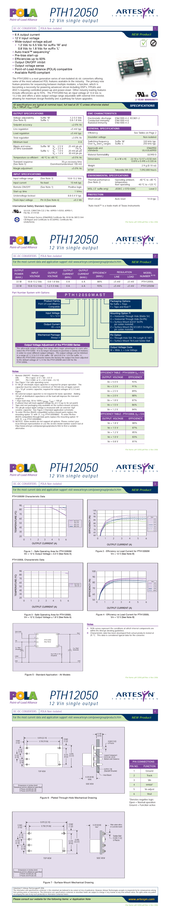

More information:  https://chipdatas.com/item/dvtdnzbv-PTH12050WAH.html




```
DC-DC CONVERTERS POLA Non-isolated 1
NEW Product
File Name: pth12050.pdf Rev: 6 Nov 2006
2 YEAR WARRANTY
All specifications are typical at nominal input, full load at 25 °C unless otherwise stated
Cin = 100 µF, Cout = 0 µF SPECIFICATIONS
The PTH12050 is a next generation series of non-isolated dc-dc converters offering
some of the most advanced POL features available in the industry. The primary new
feature provides for sequencing between multiple modules, a function, which is
becoming a necessity for powering advanced silicon including DSP’s, FPGA’s and
ASIC’s requiring controlled power-up and power-down Other industry leading features
include efficiencies up to 93%. The PTH12050 has an input voltage of 10.8 Vdc to
13.2 Vdc and offers a wide output voltage range adjustable with external trim resistor,
allowing for maximum design flexibility and a pathway for future upgrades.
• 6 A output current
• 12 V input voltage
• Wide-output voltage adjust 
• 1.2 Vdc to 5.5 Vdc for suffix ‘W’ and 
0.8 Vdc to 1.8 Vdc for suffix ‘L’
• Auto-track™ sequencing*
• Pre-bias start-up
• Efficiencies up to 93%
• Output ON/OFF inhibit
• Output voltage sense
• Point-of-Load-Alliance (POLA) compatible
• Available RoHS compliant 
*Auto-track™ is a trade mark of Texas Instruments
PTH12050
12 Vin single output
International Safety Standard Approvals
UL/cUL CAN/CSA-C22.2 No. 60950-1-03/UL 60950-1,
File No. E174104
TÜV Product Service (EN60950) Certificate No. B 04 06 38572 044
CB Report and Certificate to IEC60950, Certificate No. 
US/8292/UL
OUTPUT SPECIFICATIONS
Voltage adjustability Suffix ‘W’ 1.2-5.5 Vdc
(See Note 4) Suffix ‘L’ 0.8-1.8 Vdc
Setpoint accuracy ±2.0% Vo
Line regulation ±5 mV typ.
Load regulation ±5 mV typ.
Total regulation ±3.0% Vo
Minimum load 0 A
Ripple and noise Suffix ‘W’ Vo ≤ 2.5 V 25 mV pk-pk
20 MHz bandwidth Vo > 2.5 V 1% Vo
Suffix ‘L’ Vo ≤ 1.0 V 20 mV pk-pk
Vo > 1.0 V 30 mV pk-pk
Temperature co-efficient -40 ºC to +85 ºC ±0.5% Vo
Transient response 70 µs recovery time
(See Note 5) Overshoot/undershoot 100 mV
Margin adjustment ±5.0% Vo
INPUT SPECIFICATIONS
Input voltage range (See Note 3) 10.8-13.2 Vdc
Input current No load 10 mA typ.
Remote ON/OFF (See Note 1) Positive logic
Start-up time 1 V/ms
Undervoltage lockout 8.8-0.4 V typ.
Track input voltage Pin 8 (See Note 6) ±0.3 Vin
EMC CHARACTERISTICS
Electrostatic discharge EN61000-4-2, IEC801-2
Conducted immunity EN61000-4-6
Radiated immunity EN61000-4-3
GENERAL SPECIFICATIONS
Efficiency See Tables on Page 2
Insulation voltage Non-isolated
Switching frequency Suffix ‘W’ 320 kHz typ.
Over Vin and Io ranges Suffix ‘L’ 250 kHz typ.
Approvals and EN60950
standards UL/cUL60950
Material flammability UL94V-0
Dimensions (L x W x H) 22.10 x 12.57 x 8.50 mm 
0.870 x 0.495 x 0.335 in
Weight 2.9 g (0.10 oz)
MTBF Telcordia SR-332 7,092,000 hours
ENVIRONMENTAL SPECIFICATIONS
Thermal performance Operating ambient, -40 ºC to +85 ºC
(See Note 2) temperature
Non-operating -40 ºC to +125 ºC
MSL (‘Z’ suffix only) JEDEC J-STD-020C Level 3
PROTECTION
Short-circuit Auto reset 14 A typ.
File Name: pth12050.pdf Rev: 6 Nov 2006
For the most current data and application support visit www.artesyn.com/powergroup/products.htm
DC-DC CONVERTERS POLA Non-isolated2 2
NEW Product
Notes 1 Remote ON/OFF. Positive Logic
ON: Pin 3 open; or V > Vin - 0.5 V
OFF: Pin 3 GND; or V < 0.8 V (min - 0.2 V).
2 See Figure 1 for safe operating curve.
3 A 100 µF electrolytic input capacitor is required for proper operation. The
capacitor must be rated for a minimum of 750 mA rms of ripple current.
C2 = 10 µF ceramic capacitor, required for output voltages of 3.3 V and
higher.
4 An external output capacitor is not required for basic operation. Adding
100 µF of distributed capacitance at the load will improve the transient
response.
5 1 A/µs load step, 50 to 100% Iomax, Cout = 100 µF. 6 If utilized Vout will track applied voltage by ±0.3 V (up to Vo set point).
7 Tape and reel packaging only available on the surface-mount versions.
8 The pk-pk output ripple voltage is measured with an external 10µF
ceramic capacitor. See Figure 3 Standard application schematic.
9 To order Pb-free (RoHS compatible) surface-mount parts replace the
mounting option ‘S’ with ‘Z’, e.g. PTH12050WAZ. To order Pb-free
(RoHS compatible) through-hole parts replace the mounting option ‘H’
with ‘D’, e.g. PTH12050WAD.
10 NOTICE: Some models do not support all options. Please contact your
local Artesyn representative or use the on-line model number search tool at
http://www.artesyn.com/powergroup/products.htm to find a suitable
alternative.
PTH12050WAST Part Number System with Options
Product Family
Point of Load Alliance
Compatible 
The ultra-wide output voltage trim range offers major advantages to users who
select the PTH12050. It is no longer necessary to purchase a variety of modules
in order to cover different output voltages. The output voltage can be trimmed
in a range of 1.2 V to 5.5 V for suffix ‘-W’ and 0.8 V to 1.8 V for suffix ‘-L’.
When the PTH12050 converter leaves the factory the output has been adjusted
to the default voltage of 1.2 V for the PTH12050W and 0.8V for the
PTH12050L.
Output Voltage Adjustment of the PTH12050 Series
Output Current
05 = 6 A
Input Voltage
12 = 12 V
Mechanical Package
Always 0
PTH12050
12 Vin single output
Packaging Options
No Suffix = Trays
T = Tape and Reel (7)
Pin Option
A = Through-Hole Std. Pin Length (0.140”)
A = Surface-Mount Tin/Lead Solder Ball
Output Voltage Code
W = Wide. L = Low Voltage 
EFFICIENCY TABLE - PTH12050L (IO = 5 A)
OUTPUT VOLTAGE EFFICIENCY
Vo = 1.8 V 88%
Vo = 1.5 V 87%
Vo = 1.2 V 85%
Vo = 1.0 V 83%
Vo = 0.8 V 81%
EFFICIENCY TABLE - PTH12050W (IO = 5 A)
OUTPUT VOLTAGE EFFICIENCY
Vo = 5.0 V 93%
Vo = 3.3 V 91%
Vo = 2.5 V 89%
Vo = 2.0 V 88%
Vo = 1.8 V 87%
Vo = 1.5 V 86%
Vo = 1.2 V 84%
Mounting Option (9)
D = Horizontal Through-Hole (Matte Sn)
H = Horizontal Through-Hole (Sn/Pb)
S = Surface-Mount (63/37 Sn/Pb
pin solder material)
Z = Surface-Mount (96.5/3.0/0.5 Sn/Ag/Cu
pin solder material)
OUTPUT
INPUT OUTPUT
OUTPUT OUTPUT
EFFICIENCY REGULATION MODEL POWER 
VOLTAGE VOLTAGE
CURRENT CURRENT
(MAX.) LINE LOAD NUMBER (9,10)
(MAX.) (MIN.) (MAX.)
33 W 10.8-13.2 Vdc 0.8-1.8 Vdc 0 A 6 A 88% ±5 mV ±5 mV PTH12050L
33 W 10.8-13.2 Vdc 1.2-5.5 Vdc 0 A 6 A 93% ±5 mV ±5 mV PTH12050W
0 1 23 456
20
30
40
50
60
80
00 LFM
00 LFM
00 LFM
at Conv
90
70
TEMPERATURE (ºC)
OUTPUT CURRENT (A)
SET 0.5%, 0.1W
(Required)
PTH12050
Top View)
6
Auto-track
GND GND
Vin
C 100
(Required)
Inhibit
Cout 100
(Optional)
Vout
EFFICIENCY (%)
OUTPUT CURRENT (A)
60
65
75
85
80
95
100
01 2 3 4 5 6
.0V
3.3V
.5V
2.0V
1.8V
Vout
70
90
.5V
.2V
0 123456
20
30
40
50
60
80
100 LFM
Nat Conv
90
70
TEMPERATURE (ºC)
OUTPUT CURRENT (A)
EFFICIENCY (%)
OUTPUT CURRENT (A)
1.8V
.5V
1.2V
.0V
0.8V
50
60
70
80
90
100
01234 5
Vout
6
For the most current data and application support visit www.artesyn.com/powergroup/products.htm
DC-DC CONVERTERS POLA Non-isolated 3
NEW Product
File Name: pth12050.pdf Rev: 6 Nov 2006
PTH12050
12 Vin single output
Figure 1 - Safe Operating Area for PTH12050W
Vin = 12 V, Output Voltage = 3.3 V (See Note A)
Figure 5 - Standard Application - All Models
Notes A SOA curves represent the conditions at which internal components are
within the Artesyn derating guidelines.
B Characteristic data has been developed from actual products tested at
25 °C. This data is considered typical data for the converter.
Figure 2 - Efficiency vs Load Current for PTH12050W
Vin = 12 V (See Note B)
PTH12050W Characteristic Data
Figure 3 - Safe Operating Area for PTH12050L
Vin = 12 V, Output Voltage ≤ 1.8 V (See Note A)
Figure 4 - Efficiency vs Load Current for PTH12050L
Vin = 12 V (See Note B)
PTH12050L Characteristic Data
Dimensions in Inches (mm) olerances (unless otherwise specified) 2 Places 0.030 ( 0.76) 3 Places 0.010 ( 0.25)
TOP VIEW
SIDE VIEW
0.870 (22.10)
MAX.
0.335 (8.50) Host Board
0.495
12.57)
.040 (1.02)
6 Places 0.750 (19.06)
.125
(3.18)
0.125
(3.18)
0.125
(3.18)
(1.52)
0.060
9.52)
0.375
1.52)
0.060
3.55)
0.140
Lowest Component
0.010 min. (0.25)
Bottom side Clearance
0.070 (1.78)
(Standoff Shoulder)
Dimensions in Inches (mm) olerances (unless otherwise specified) 2 Places 0.030 ( 0.76) 3 Places 0.010 ( 0.25)
0.870 (22.10)
0.495
TOP VIEW SIDE VIEW
Solder Ball
0.040 (1.02)
6 Places
0.750 (19.06) (1.52)
0.060 (1.52)
0.060
(12.57)
(3.18)
0.125
(3.18)
0.125
0.125
(3.18) 0.375
(9.52)
*After solder reflow
on customer board 0.335 (8.50)
max.*
File Name: pth12050.pdf Rev: 6 Nov 2006
Please consult our website for the following items: ✔ Application Note www.artesyn.com
Datasheet © Artesyn Technologies® 2006
The information and specifications contained in this datasheet are believed to be correct at time of publication. However, Artesyn Technologies accepts no responsibility for consequences arising
from printing errors or inaccuracies. The information and specifications contained or described herein are subject to change in any manner at any time without notice. No rights under any patent
accompany the sale of any such product(s) or information contained herein.
For the most current data and application support visit www.artesyn.com/powergroup/products.htm
DC-DC CONVERTERS POLA Non-isolated 4
NEW Product
PTH12050
12 Vin single output
Figure 6 - Plated Through-Hole Mechanical Drawing
Figure 7 - Surface-Mount Mechanical Drawing
*Denotes negative logic:
Open = Normal operation
Ground = Function active
PIN CONNECTIONS
PIN NO. FUNCTION
1 Ground
2 Track
3 Vin
4 Inhibit*
5 Vo adjust
6 Vout
```
